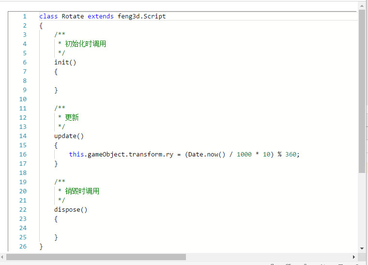

# 创建新脚本

要创建一个新的脚本，需要右击的资源面板并选择新的脚本“New Script”进行创建。你会被要求为您的新的脚本文件输入名称。


双击面板中的脚本资源，然后它会在代码编辑器中被打开。



## 添加脚本组件

脚本组件以和其它组件以相同的方式被创建。一旦你创建了一个脚本组件，您可以开始选择资源列表的脚本。


当你选择了一个脚本并把它添加到一个组件上时, 脚本内容会被解析并将已声明的属性在组件面板上暴露出来。

```typescript
class Rotate extends feng3d.Script
{
    @feng3d.oav()
    speed = 10;

    /**
     * 初始化时调用
     */
    init()
    {

    }

    /**
     * 更新
     */
    update()
    {
        this.gameObject.transform.ry = (Date.now() / 1000 * this.speed) % 360;
    }

    /**
     * 销毁时调用
     */
    dispose()
    {

    }
}
```
