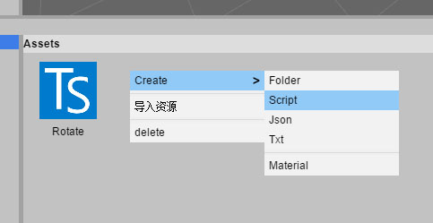
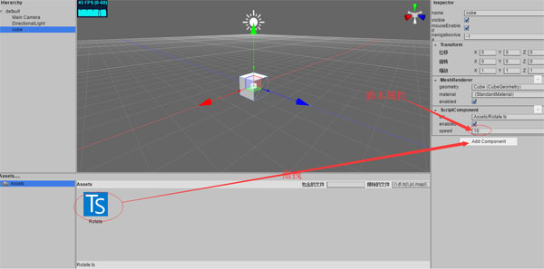

# 脚本

用户可以通过脚本进行feng3d应用交互。脚本使用“TypeScript”程序语言设计，应用在项目网页。

用户可以想象一下应用程序被分割成两个独立的代码库。有feng3d所提供的引擎，实现了通用功能譬如图形绘制，输入处理，音频，feng3d工具的接口；应用程序的脚本或者可以显示有效行为的可重复使用块。

一般来说用户并不需要担心引擎代码，这只是包含在用户应用程序中的一个简单的TypeScript文件。

脚本挂在脚本组件上，脚本组件控制脚本的初始化，更新以及销毁。

## 新建脚本

要创建一个新的脚本，需要右击的资源面板并选择新的脚本“New Script”进行创建。你会被要求为您的新的脚本文件输入名称。



在文件上右键菜单选择“编辑”。

```typescript
class NewScript extends feng3d.Script
{

    /** 
     * 测试属性 
     */
    @feng3d.serialize
    @feng3d.oav()
    speed = 10;

    /**
     * 初始化时调用
     */
    init()
    {

    }

    /**
     * 更新
     */
    update()
    {
        this.gameObject.transform.ry = (Date.now() / 1000 * this.speed) % 360;
    }

    /**
     * 销毁时调用
     */
    dispose()
    {

    }
}
```

## 添加脚本组件

脚本组件以和其它组件以相同的方式被创建。一旦你创建了一个脚本组件，您可以开始选择资源列表的脚本。



当你选择了一个脚本并把它添加到一个组件上时, 脚本内容会被解析并将已声明的属性在组件面板上暴露出来。

## 脚本之间继承

```typescript
class NewScript1 extends NewScript
{

    /** 
     * 测试属性 
     */
    @feng3d.serialize
    @feng3d.oav()
    t_attr = new feng3d.Color4();

    /**
     * 初始化时调用
     */
    init()
    {

    }

    /**
     * 更新
     */
    update()
    {

    }

    /**
     * 销毁时调用
     */
    dispose()
    {

    }
}
```