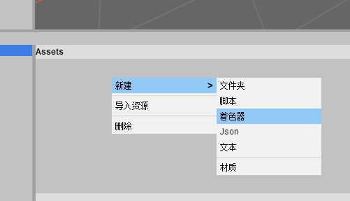
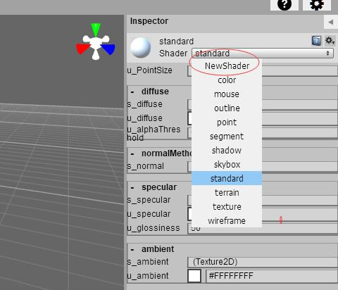
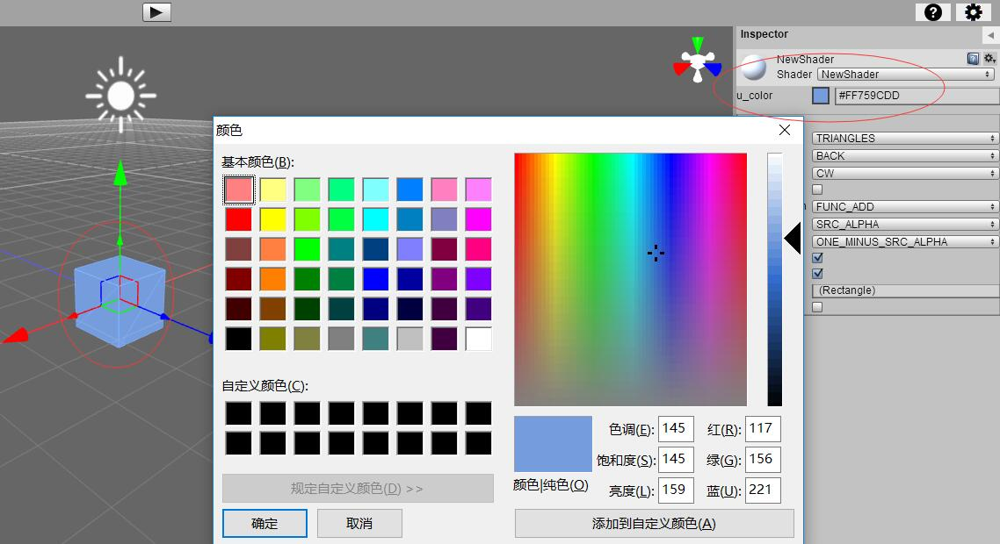
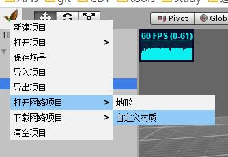

# 着色器

用户可以通过创建着色器给材质使用，从而实现丰富多彩的渲染效果。

## 新建着色器

要创建一个新的着色器，需要右击的资源面板并选择“着色器”进行创建。你会被要求为您的新的着色器文件输入名称。



## 编辑着色器

在文件上右键菜单选择“编辑”。

```typescript
class NewShaderUniforms
{
    /** 
     * 颜色 
     */
    @feng3d.serialize
    @feng3d.oav()
    u_color = new feng3d.Color4();
}

feng3d.shaderConfig.shaders["NewShader"] = {
    cls: NewShaderUniforms,
    vertex: `
    
    attribute vec3 a_position;
    
    uniform mat4 u_modelMatrix;
    uniform mat4 u_viewProjection;
    
    void main(void) {
    
        vec4 globalPosition = u_modelMatrix * vec4(a_position, 1.0);
        gl_Position = u_viewProjection * globalPosition;
    }`,
    fragment: `
    
    precision mediump float;
    
    uniform vec4 u_color;
    
    void main(void) {
        
        gl_FragColor = u_color;
    }
    `,
};


// 以下部分可以省略，此代码是为了提供用户使用代码使用该着色器创建材质时代码提示功能
type NewShaderMaterial = feng3d.Material & { uniforms: NewShaderUniforms; };
interface MaterialFactory
{
    create(shader: "NewShader", raw?: NewShaderMaterialRaw): NewShaderMaterial;
}

interface MaterialRawMap
{
    NewShader: NewShaderMaterialRaw
}

interface NewShaderMaterialRaw extends feng3d.MaterialBaseRaw
{
    shaderName?: "NewShader",
    uniforms?: NewShaderUniformsRaw;
}

interface NewShaderUniformsRaw
{
    __class__?: "feng3d.NewShaderUniforms",
    u_time?: number,
}
```

## 使用着色器

进入材质属性面板（可以是从材质文件属性中进入，也可以通过层级树中游戏对象->MeshRenderer->matrial进入），选择使用创建的新材质



## 调整材质中着色器值



## 着色器示例


