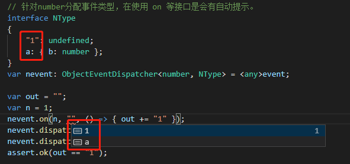
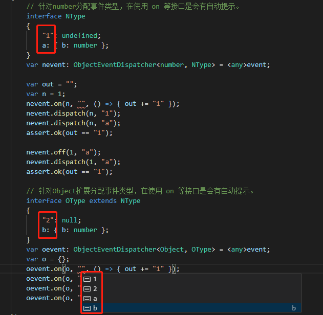

# Event

## 事件系统
 
相信大多数程序员都知道事件这东西，比如鼠标点击事件、文件更改事件等等。同样也相信大家能够轻松愉快的写出一个不错的事件系统。但是还是希望能够把feng3d中这个优秀的事件系统介绍给大家。

## feng3d.anyEmitter: ObjectEmitter

### 在任意对象上派发任意事件
```
    var out = "";
    //
    var n = 1;
    var s = "a";
    var o = {};
    // 监听任意对象的任意事件
    anyEmitter.on(n, "n", () => { out += "n" });
    anyEmitter.on(s, "s", () => { out += "s" });
    anyEmitter.on(o, "o", () => { out += "o" });
    // 派发事件
    anyEmitter.dispatch(n, "n");
    anyEmitter.dispatch(s, "s");
    anyEmitter.dispatch(o, "o");
    // 监听回调被正常调用
    assert.ok(out == "nso");
```
### 监听回调上下文
```
    var out = "";
    // 使用obj作为监听回调上下文
    var obj = { v: 1, fn: function (event: Event<any>) { out += anyEmitter.type + this.v; } };
    anyEmitter.on(obj, "click", obj.fn, obj);
    // 重复监听一次派发事件仅会被调用一次
    anyEmitter.on(obj, "click", obj.fn, obj);
    anyEmitter.dispatch(obj, "click");
    assert.ok(out == "click1");
```
### 监听器优先级
```
    var out = "";
    // 相同事件类似的监听器优先级越高越优先被调用
    anyEmitter.on(1, "pevent", () => { out += "p1" }, null, 1);
    anyEmitter.on(1, "pevent", () => { out += "p0" }, null, 0);
    anyEmitter.on(1, "pevent", () => { out += "p2" }, null, 2);
    anyEmitter.dispatch(1, "pevent");
    assert.ok(out == "p2p1p0");
```
### 批量移除监听
```
    var out = "";
    var fn = () => { out += "1" };
    var fn2 = () => { out += "2" };
    anyEmitter.on(1, "b", fn);
    anyEmitter.on(1, "b", fn2);
    // off缺省监听回调时移除指定事件类型所有监听。
    anyEmitter.off(1, "b");
    anyEmitter.dispatch(1, "b");
    assert.ok(!anyEmitter.has(1, "b"));
    assert.ok(out == "");
```
```
    var out = "";
    var fn = () => { out += "1" };
    var fn2 = () => { out += "2" };
    anyEmitter.on(1, "c", fn);
    anyEmitter.on(1, "d", fn2);
    anyEmitter.onAny(1, fn2);
    // off 缺省 事件类型时将会移除指定对象上所有事件监听。
    anyEmitter.off(1);
    anyEmitter.dispatch(1, "c");
    anyEmitter.dispatch(1, "d");
    assert.ok(!anyEmitter.has(1, "c"));
    assert.ok(!anyEmitter.has(1, "d"));
    assert.ok(out == "");
```
### 任意事件监听
```
    var out = "";
    var fn = (e: Event<any>) => { out += e.type };
    // 新增一个对象的任意事件监听器。
    anyEmitter.onAny(1, fn);

    // 配发多个不同事件后均被触发监听器。
    anyEmitter.dispatch(1, "a");
    anyEmitter.dispatch(1, "b");
    anyEmitter.dispatch(1, "c");
    assert.ok(out == "abc");

    // 移除后并不会再次被触发。
    anyEmitter.offAny(1, fn);
    anyEmitter.dispatch(1, "a");
    anyEmitter.dispatch(1, "b");
    anyEmitter.dispatch(1, "c");
    assert.ok(out == "abc");
```
### 事件冒泡
```
    // dispatch 携带数据 冒泡
    var data = { d: 0 };
    var out: Event<any> = null;
    var parent = { v: 0 };
    var child = { v: 1, parent: parent };
    anyEmitter.on(parent, "b", (e) => { out = e; })
    anyEmitter.dispatch(child, "b", data, true);
    assert.ok(out.data == data);
    // 派发事件的对象
    assert.ok(out.target == child);
    // 当前处理事件的对象
    assert.ok(out.currentTarget == parent);
    // 事件冒泡流向
    assert.ok(out.targets[0] == child);
    assert.ok(out.targets[1] == parent);
```
### 停止事件的冒泡
```
    // 处理停止事件的冒泡
    var parent = { v: 0 };
    var child = { v: 1, parent: parent };
    var outstr = "";
    anyEmitter.on(child, "b1", (e) => { e.isStopBubbles = true; }, null, -1); // 新增优先级较低的监听器，并停止冒泡行为。
    anyEmitter.on(child, "b1", (e) => { outstr += "child0"; }, null, 0); // 该监听器将会被触发。
    anyEmitter.on(child, "b1", (e) => { outstr += "child-1"; }, null, -2); // 该监听器将会被触发。
    anyEmitter.on(parent, "b1", (e) => { outstr += "parent"; }); // 冒泡被终止，该监听器不会被触发。
    anyEmitter.dispatch(child, "b1", null, true);
    assert.equal(outstr, "child0child-1");
```
### 停止事件流
```
    // 处理停止事件
    var parent = { v: 0 };
    var child = { v: 1, parent: parent };
    var outstr = "";
    anyEmitter.on(child, "b2", (e) => { e.isStop = true; }, null, -1); // 新增优先级较低的监听器，并停止事件流。
    anyEmitter.on(child, "b2", (e) => { outstr += "child0"; }, null, 0); // 该监听器将会被触发。
    anyEmitter.on(child, "b2", (e) => { outstr += "child-1"; }, null, -2); // 事件被终止，该监听器优先级较低将不会被触发。
    anyEmitter.on(parent, "b2", (e) => { outstr += "parent"; }); // 事件被终止，该监听器不会被触发。
    anyEmitter.dispatch(child, "b2", null, true);
    assert.equal(outstr, "child0");
```
### 事件名称提示
```
    // 针对number分配事件类型，在使用 on 等接口是会有自动提示。
    interface NType
    {
        "1": undefined;
        a: { b: number };
    }
    var nevent: ObjectEventDispatcher<number, NType> = <any>anyEmitter;

    var out = "";
    var n = 1;
    nevent.on(n, "a", () => { out += "1" });
    nevent.dispatch(n, "1");
    nevent.dispatch(n, "a");
    assert.ok(out == "1");

    nevent.off(1, "a");
    nevent.dispatch(1, "a");
    assert.ok(out == "1");

    // 针对Object扩展分配事件类型，在使用 on 等接口是会有自动提示。
    interface OType extends NType
    {
        "2": null;
        b: { b: number };
    }
    var oevent: ObjectEventDispatcher<Object, OType> = <any>anyEmitter;
    var o = {};
    oevent.on(o, "1", () => { out += "1" });
    oevent.on(o, "2", () => { out += "1" });
    oevent.on(o, "a", () => { out += "1" });
    oevent.on(o, "b", () => { out += "1" });
```
#### 效果如下





## feng3d.EventDispatcher
EventDispatcher 功能的实现几乎由 FEvent 实现，但提供了一个事件派发器的基类。
```

    interface DisplayObjectEventMap
    {
        click: { x: number, y: number };
        mousedown: { x: number, y: number };
        mousemove: { x: number, y: number };
        mouseup: { x: number, y: number };
    }

    // 这块代码很脏，希望能够简化这块代码的大佬不吝赐教！
    interface DisplayObject
    {
        once<K extends keyof DisplayObjectEventMap>(type: K, listener: (event: Event<DisplayObjectEventMap[K]>) => void, thisObject?: any, priority?: number): void;
        dispatch<K extends keyof DisplayObjectEventMap>(type: K, data?: DisplayObjectEventMap[K], bubbles?: boolean): Event<DisplayObjectEventMap[K]>;
        has<K extends keyof DisplayObjectEventMap>(type: K): boolean;
        on<K extends keyof DisplayObjectEventMap>(type: K, listener: (event: Event<DisplayObjectEventMap[K]>) => void, thisObject?: any, priority?: number, once?: boolean): void;
        off<K extends keyof DisplayObjectEventMap>(type?: K, listener?: (event: Event<DisplayObjectEventMap[K]>) => void, thisObject?: any): void;
    }
    // 很希望能够使用下面代码，但是编译错误！
    // interface DisplayObject extends IEventDispatcher<DisplayObjectEventMap> { }

    class DisplayObject extends EventDispatcher
    {
        parent: Container;
    }

    interface ContainerEventMap extends DisplayObjectEventMap
    {
        addedChild: { parent: Container, child: DisplayObject };
    }

    // 这块代码很脏，希望能够简化这块代码的大佬不吝赐教！
    interface Container
    {
        once<K extends keyof ContainerEventMap>(type: K, listener: (event: Event<ContainerEventMap[K]>) => void, thisObject?: any, priority?: number): void;
        dispatch<K extends keyof ContainerEventMap>(type: K, data?: ContainerEventMap[K], bubbles?: boolean): Event<ContainerEventMap[K]>;
        has<K extends keyof ContainerEventMap>(type: K): boolean;
        on<K extends keyof ContainerEventMap>(type: K, listener: (event: Event<ContainerEventMap[K]>) => void, thisObject?: any, priority?: number, once?: boolean): void;
        off<K extends keyof ContainerEventMap>(type?: K, listener?: (event: Event<ContainerEventMap[K]>) => void, thisObject?: any): void;
    }
    // 很希望能够使用下面代码，但是编译错误！
    // interface Container extends IEventDispatcher<ContainerEventMap> { }

    class Container extends DisplayObject
    {
        children: DisplayObject[] = [];

        addChild(child: DisplayObject)
        {
            this.children.push(child);
            child.parent = this;
            this.dispatch("addedChild", { parent: this, child: child });
        }
    }

    //
    var displayObject = new DisplayObject();
    // 在使用 on 时提供不错的提示告知DisplayObject可以监听的所有事件列表。
    displayObject.on("click", (e) => { out += "displayObjectclick"; });
    displayObject.on("mousedown", (e) => { out += "displayObjectmousedown"; });
    displayObject.on("mousemove", (e) => { out += "displayObjectmousemove"; });
    displayObject.on("mouseup", (e) => { out += "displayObjectmouseup"; });

    var container = new Container();
    // 在使用 on 时看见到Container以及基类DisplayObject所支持的事件列表。
    container.on("click", (e) => { out += "containerclick"; });
    container.on("addedChild", (e) => { out += "containeraddedChild"; });

    // 新增子对象
    var out = "";
    container.addChild(displayObject);
    assert.ok(out == "containeraddedChild");

    // 派发冒泡事件
    out = "";
    displayObject.dispatch("click", { x: 1, y: 2 }, true);
    assert.ok(out == "displayObjectclickcontainerclick");
```

## 源码

https://gitee.com/feng3d/feng3d/blob/master/packages/events/src/FEvent.ts

https://gitee.com/feng3d/feng3d/blob/master/packages/events/src/EventDispatcher.ts

## 参考

### three.js

https://github.com/mrdoob/three.js/blob/dev/src/core/EventDispatcher.js

### playcanvas

https://github.com/playcanvas/engine/blob/master/src/core/event-handler.js

### babylonjs 感觉实现比较奇怪

https://github.com/BabylonJS/Babylon.js/blob/master/src/Misc/observable.ts

### pixi.js

https://github.com/pixijs/pixi.js/blob/dev/types/events.d.ts 
https://github.com/primus/eventemitter3/blob/master/index.d.ts

### adobe flash

https://help.adobe.com/en_US/FlashPlatform/reference/actionscript/3/flash/events/EventDispatcher.html

## 比较

| 引擎事件系统 | 基础API | 事件派发器基类 | 监听回调上下文 | 优先级 | 批量移除监听 | 事件冒泡 | 事件名称提示 |
| :----------: | :-----: | :------------: | :------------: | :----: | :----------: | :------: | :----------: |
|    feng3d    |    √    |       √        |       √        |   √    |      √       |    √     |      √       |
|   three.js   |    √    |       √        |       ×        |   ×    |      √       |    ×     |      ×       |
|  playcanvas  |    √    |       √        |       √        |   ×    |      √       |    ×     |      ×       |
|  babylonjs   |    √    |       √        |       √        |   √    |      √       |    √     |      ×       |
|   pixi.js    |    √    |       √        |       √        |   ×    |      √       |    ×     |      ×       |
| adobe flash  |    √    |       √        |       √        |   √    |      ×       |    √     |      √       |