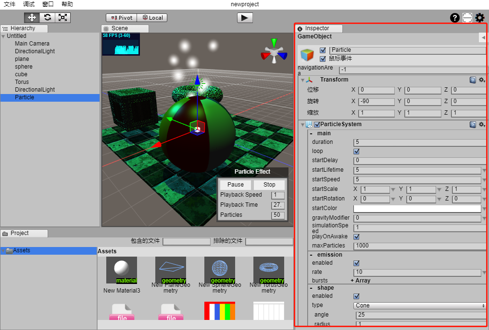

# @feng3d/objectview

[](https://www.npmjs.com/package/@feng3d/objectview)
[](https://github.com/feng3d/objectview/blob/master/LICENSE)

@feng3d/objectview 是 feng3d 中实现由数据对象自动生成界面的一套框架。

减少了绝大多数的界面逻辑代码编写，解决了数据对象与界面同步问题，极大的提升了 UI 开发效率。

## 📦 安装

```bash
npm install @feng3d/objectview
```

## 🔗 链接

- **源码**: https://gitee.com/feng3d/objectview.git
- **文档**: https://feng3d.com/objectview

## 🎯 特性

- **自动界面生成** - 根据数据对象自动创建对应的 UI 界面
- **装饰器配置** - 使用 `@oav`、`@ov` 等装饰器轻松配置属性显示方式
- **UI 框架无关** - 可适配 HTMLElement、Vue、React 等任意 UI 框架
- **双向数据绑定** - 数据变化实时更新界面，界面操作实时修改数据
- **属性分组** - 支持属性分组显示（OBV - Object Block View）
- **可扩展组件** - 支持自定义 OAV、OBV、OV 组件

## 🏗️ 实现原理

1. **OAV（Object Attribute View）** - 针对对象的每一条属性自动生成属性界面，实现对象属性与界面的对应关系，支持属性值与 OAV 双向同步
2. **OBV（Object Block View）**（可选）- 支持多个属性进行分组，自动生成属性块界面
3. **OV（Object View）**（可选）- 支持数据对象自动生成完整的对象界面

## 🚀 快速开始

### 基本用法

```typescript
import { oav, ov, objectview } from '@feng3d/objectview';

// 1. 定义数据模型，使用装饰器标记属性
@ov({ component: 'OVDefault' })
class GameObject {
    @oav()
    name = 'MyObject';

    @oav({ component: 'OAVBoolean' })
    enabled = true;

    @oav({ component: 'OAVNumber' })
    value = 100;
}

// 2. 创建对象实例
const gameObject = new GameObject();

// 3. 获取对象界面
const view = objectview.getObjectView(gameObject);
```

### 属性分组

```typescript
@ov({ component: 'OVDefault' })
class Transform {
    @oav({ block: 'Position', component: 'OAVNumber' })
    x = 0;

    @oav({ block: 'Position', component: 'OAVNumber' })
    y = 0;

    @oav({ block: 'Rotation', component: 'OAVNumber' })
    rotation = 0;
}
```

### 框架初始化

```typescript
import { objectview } from '@feng3d/objectview';

// 配置默认界面组件
objectview.defaultBaseObjectViewClass = 'OVBaseDefault';
objectview.defaultObjectViewClass = 'OVDefault';
objectview.defaultObjectAttributeViewClass = 'OAVDefault';
objectview.defaultObjectAttributeBlockView = 'OBVDefault';

// 配置特定类型的默认 OAV 组件
objectview.setDefaultTypeAttributeView('Boolean', { component: 'OAVBoolean' });
objectview.setDefaultTypeAttributeView('String', { component: 'OAVString' });
objectview.setDefaultTypeAttributeView('number', { component: 'OAVNumber' });
```

## 📖 API

### 装饰器

| 装饰器 | 说明 |
|--------|------|
| `@ov(param)` | 类装饰器，配置对象界面组件 |
| `@oav(param)` | 属性装饰器，配置属性界面组件 |
| `@OVComponent(name)` | 注册 OV 组件类 |
| `@OBVComponent(name)` | 注册 OBV 组件类 |
| `@OAVComponent(name)` | 注册 OAV 组件类 |

### OAV 参数

```typescript
interface OAVComponentParams {
    component?: string;      // 组件名称
    componentParam?: any;    // 组件参数
    editable?: boolean;      // 是否可编辑
    block?: string;          // 所属块名称
    tooltip?: string;        // 提示信息
    priority?: number;       // 优先级（数字越小越靠前）
    exclude?: boolean;       // 是否排除
}
```

### 核心方法

```typescript
// 获取对象界面
objectview.getObjectView(object: any, param?: GetObjectViewParam): IObjectView

// 获取属性界面
objectview.getAttributeView(attributeViewInfo: AttributeViewInfo): IObjectAttributeView

// 获取块界面
objectview.getBlockView(blockViewInfo: BlockViewInfo): IObjectBlockView

// 获取对象信息
objectview.getObjectInfo(object: any, autocreate?: boolean, excludeAttrs?: string[]): ObjectViewInfo
```

## 📁 项目结构

```
objectview/
├── src/                    # 核心库源码
│   ├── index.ts           # 入口文件
│   └── ObjectView.ts      # ObjectView 核心实现
├── examples/               # Vue 3 示例项目
│   └── src/
│       └── ov/            # Vue 组件实现
└── test/                   # 测试文件
```

## 🎨 示例项目

`examples/` 目录包含基于 Vue 3 的完整示例，展示如何实现 OAV、OBV、OV 组件。

```bash
cd examples
npm install
npm run dev
```

详见 [examples/README.md](./examples/README.md)

## 🔧 框架边界

ObjectView 只处理数据对象与界面的对应关系，并不实际处理具体的 OAV、OBV、OV 的实现与数据绑定逻辑，与具体的 UI 框架无关。这意味着可以运用到：

- HTMLElement
- Vue / React / Angular
- 甚至可以翻译为其他语言

## 🛠️ 开发

```bash
# 安装依赖
npm install

# 运行测试
npm test

# 构建
npm run build

# 生成文档
npm run docs

# 代码检查
npm run lint
```

## 📚 相关资源

### 历史版本

- ActionScript 版本: https://github.com/wardenfeng/ObjectView-as
- 旧 TypeScript 版本: https://github.com/wardenfeng/ObjectView-ts

## 📸 项目使用案例

下图中 feng3d 编辑器的右侧红框部分 Inspector 模块所有显示均使用 ObjectView 进行构建。



## 📄 License

[MIT](./LICENSE)
