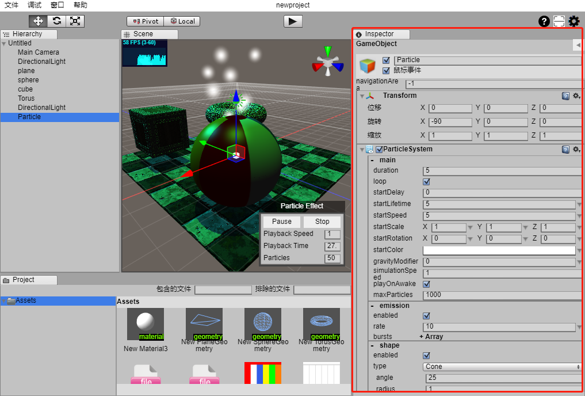

# ObjectView

## 什么是ObjectView

ObjectView是feng3d中实现由数据对象自动生成界面的一套框架。

## 解决的问题

减少了绝大多数的界面逻辑代码编写，解决了数据对象与界面同步问题，极大的提升了UI开发效率。

## 实现原理

1. （核心）针对对象的每一条需要显示的属性自动生成一个OAV（ObjectAttributeView也称为对象属性界面），实现对象属性与界面的对应关系，需要提供属性值与OAV双向同步功能（数据发生变化后界面实时刷新，用户在界面上操作是实时更改数据）。
1. （可选）支持多个属性进行分组自动生成一个OBV（ObjectBlockView也称为对象属性块界面），实现对象属性组与界面的对应关系。
1. （可选）支持数据对象自动生成生成一个OV（ObjectView也称为对象界面），实现对象与界面的对应关系。

## 提供API

```
/**
 * 获取对象界面
 * @param object 用于生成界面的对象
 * @param param 参数
 */
feng3d.ObjectView.getObjectView(object: Object, param?: GetObjectViewParam): IObjectView
```

ObjectView框架初始化后仅仅需要调用一下代码便可以实现从数据对象到界面的转换。
```
var view = feng3d.ObjectView.getObjectView(object);
```

## ObjectView初始化

```
    // 对默认界面进行配置
    feng3d.objectview.defaultBaseObjectViewClass = "OVBaseDefault";
    feng3d.objectview.defaultObjectViewClass = "OVDefault";
    feng3d.objectview.defaultObjectAttributeViewClass = "OAVDefault";
    feng3d.objectview.defaultObjectAttributeBlockView = "OBVDefault";
    // 对自定义属性进行指定显示OAV组件
    feng3d.objectview.setDefaultTypeAttributeView("Boolean", { component: "OAVBoolean" });
    feng3d.objectview.setDefaultTypeAttributeView("String", { component: "OAVString" });
    feng3d.objectview.setDefaultTypeAttributeView("number", { component: "OAVNumber" });
```

## 实现技巧

1. 通过 feng3d.Watcher.watch 实现数据属性的变化监听，从而更新OAV实现数据到UI的同步。
1. 通过装饰器 @oav 来标记数据对象指定属性对应哪个OAV在UI中显示，以及如何分组，显示参数等信息。

## 框架边界

只处理数据对象与界面的对应关系，并不会实际去处理具体的OAV、OBV、OV的实现与数据绑定逻辑，更是与具体的UI框架无关。也就意味着可以运用到HTMLElement、egret、layabox等任意的UI框架中去，甚至可以轻松翻译为其他语言以及其他语言UI框架中去。

## 源码

https://gitee.com/feng3d/feng3d/blob/master/modules/objectview/src/ObjectView.ts

### 历史版本
https://github.com/wardenfeng/ObjectView-as

https://github.com/wardenfeng/ObjectView-ts

### 实现OAV数据绑定依赖模块

https://gitee.com/feng3d/feng3d/blob/master/modules/watcher/src/Watcher.ts

## 参考示例

https://gitee.com/feng3d_admin/objectview-jqueryui

## 项目使用案例
下图中feng3d编辑器的右侧红框部分Inspector模块所有显示均使用ObjectView进行构建。


